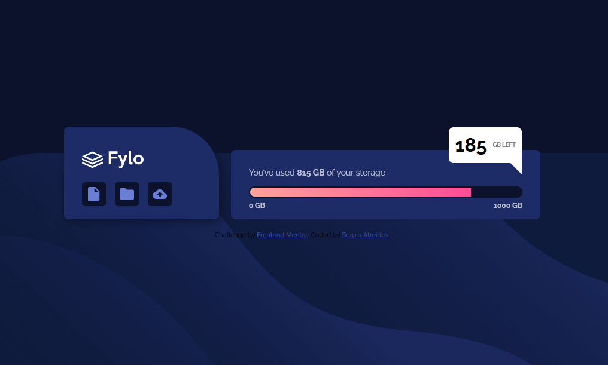

# Frontend Mentor - Fylo data storage component solution

This is a solution to the [Fylo data storage component challenge on Frontend Mentor](https://www.frontendmentor.io/challenges/fylo-data-storage-component-1dZPRbV5n). Frontend Mentor challenges help you improve your coding skills by building realistic projects. 

## Table of contents

- [Overview](#overview)
  - [The challenge](#the-challenge)
  - [Screenshot](#screenshot)
  - [Links](#links)
- [My process](#my-process)
  - [Built with](#built-with)
  - [What I learned](#what-i-learned)
  - [Continued development](#continued-development)
  - [Useful resources](#useful-resources)
- [Author](#author)

**Note: Delete this note and update the table of contents based on what sections you keep.**

## Overview

### The challenge

Users should be able to:

- View the optimal layout for the site depending on their device's screen size

### Screenshot

### Links

- Solution URL: [Add solution URL here](https://github.com/sergioatreides/fylo-data-storage-component)
- Live Site URL: [Add live site URL here](https://sergioatreides.github.io/fylo-data-storage-component/)

## My process

### Built with

- Semantic HTML5 markup
- CSS custom properties
- Flexbox
- CSS Grid

### What I learned

To use the CSS "vendor prefixex" in order to access the controls properties.

### Continued development

I'm not very happy with the way I resolved the " 185 GB left" dialog bubble implementation. I guess there's a better way to solve it (hope I'll learn it in other solutions). 

### Useful resources

- [CSS Tricks](https://css-tricks.com/html5-progress-element/) - This helped using the CSS "vendor prefixes" for the progress bar.

## Author

- Website - [Sergio Atreides](https://github.com/sergioatreides)
- Frontend Mentor - [@sergioatreides](https://www.frontendmentor.io/profile/sergioatreides)
- Twitter - [@sergio_lana](https://twitter.com/sergio_lana/)
